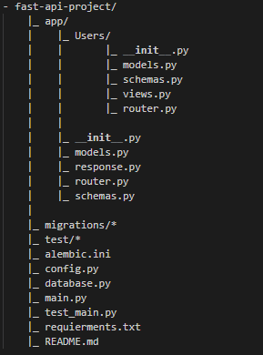

# FAST API PROJECT

## 📝 Table of Contents

- [About](#about)
- [Getting Started](#getting_started)
- [Running](#running)
- [Migration](#migration)
- [Testing](#testing)
- [Created With](#created)

## 🧐 About 

Fast Api Project created to help when starting to create new project with fast api framework, just clone this repo it will give you
a new fast api project with sqlalchemy and alembic migration, client testing for rest api, and MVC structure.

Project Structure:  

## 🏁 Getting Started 

To get started when u clone this repo, run this pip command
### pip install requierments.txt
it will give you all python package that needed for this project

## 🚀 Running <a name ="running"/>

The fast api project running with uvicorn web engine, run this command to run it.
### uvicorn app:app 

and to see all option of uvicorn, use this command
### uvicorn --help

## ✍️ Migration <a name = "migration">

This project using sqlalchemy for db engine and alembic for migrations tool.
Alembic will help us when tehere is change on the db models that has been defined,
alembic migration will automaticaly update the db structure.

To make a new migration, use this command
### alembic revision --autogenerate -m "migration message"

And to update the database with the new migration, use this command
### alembic upgrade head

## ⛏️ Testing <a name="testing"/>

Testing is an important thing when create a backend eather for web or rest api. To test a fast api project,
use the client test from fast api it self. To run the testing, use this command.

### pytest
it will run all testing scenarion for client that have been created in test package.

## 🎉 Created With 

This project use those python packages bellows:
- [Fast Api](https://fastapi.tiangolo.com/)
- [Uvicorn](https://www.uvicorn.org)
- [Sqlalchemy](https://www.sqlalchemy.org)
- [Alembic](https://alembic.sqlalchemy.org)
